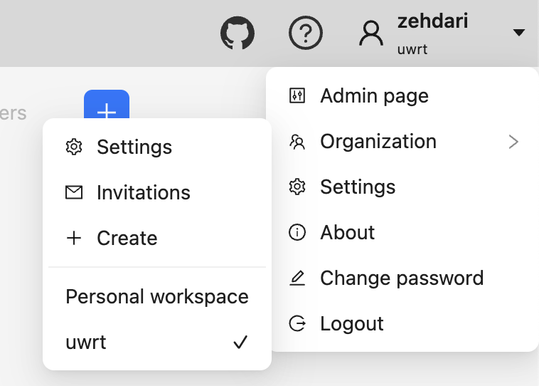
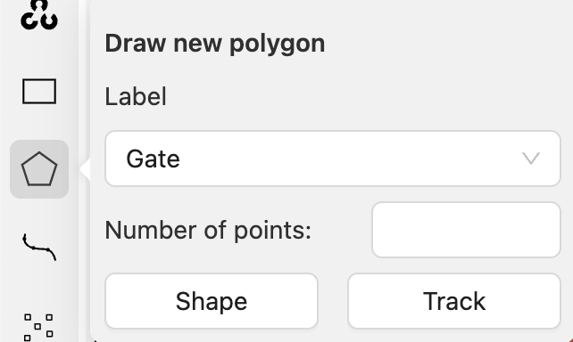

# CVAT Usage Guide

This guide will walk you through the process of using our CVAT server to label images. Follow the steps below to get started.

## 1. Logging In
1. Open the CVAT server URL in your web browser.
2. Enter your username and password.
3. Click the **Log In** button.

## 2. Selecting an Organization
1. After logging in, navigate to the user dropdown at the top right corner.
2. Select uwrt from the organization dropdown menu.

## 3. Accessing Jobs
1. Navigate to the **Jobs** tab on the top left menu.
2. You will see a list of all available jobs. Click on a job to open it.

## 4. Labeling Tasks
1. After selecting a job, you will see the task view with the images to be labeled.
2. Use the polygon tool to create labels for the images.
3. Select the appropriate label, and click track to have the label carry over to each frame.
4. Label each image as per the given instructions.

## 5. Labeling
1. On the right sidebar, it will list all current labels.
2. Use the leftmost button "Switch outside property" if the object to label is no longer visible, this will stop tracking it to the current/next frames.
3. The eye icon hides the object from the label view, useful if trying to label on top of another.
4. The star indicates the label is a "key" frame, meaning it is a manually labeled frame, and will be used to interpolate the shape between frames.
5. The pin icon keeps the label pinned to the image, click it to allow dragging the entire shape.

## 6. Interpolation
1. Labels will be "interpolated" between frames, meaning that shapes will try to automatically fit between the two closest key frames.
2. Interpolation requires that a start point be used as the primary reference, this point should be in the same location of the object (i.e the left corner) to always start from there.
3. The interpolation goes clockwise or counter-clockwise, this is indicated by the grey arrow next to the grey point. Make sure this is consistent between frames.

## 7. Submitting and Saving Labels
1. CVAT does not autosave, so make sure you click the save button to save your work.
2. Review all labels to ensure accuracy.
3. When you are satisfied with your labels, submit the job for review by clicking the **Submit** button.

## 8. Useful Keyboard Shortcuts
1. To finish a labeled shape, hit "n" to complete the shape.
2. To redo a shape entirely, hit "shift" + "n" to create a new shape. Make sure the grey point is in the same relative position to the object, and you label in the same direction, or interpolation won't work.
3. To add a point between two existing points, shift click on a point, and add new points between, then click on another existing point to attach to the existing shape.
4. Click on the arrow to change the direction for interpolation (clockwise vs counter-clockwise)
5. Right click on a point to delete it.

## 9. Examples

### Gate
#### Classes
- **Gate** - The entire gate
- **Gate Hot** - The red gate arrow
- **Gate Cold** - The blue gate arrow

### Buoy
#### Classes
- **Buoy** - The buoy itself

### Mapping
#### Classes
- **Mapping map** - The two maps on the vinyl, make sure to not include the whitespace on the vinyl
- **Mapping hole** - Each hole on the map, make sure to include the red octagon around the hole
  - Note: For mapping, don't worry about the back of the map for holes or the map itself.

### Bin
#### Classes
- **Bin** - The entire bin object
- **Bin temperature** - The red and blue insert in the bottom of the bin

### Table
#### Classes
- **Table** - The entire table top
- **Basket** - Each pink basket attached to the table
- **Tubeworm** - The red table object
- **Coral** - The orange table object
- **Nautilus** - The yellow table object

## 10. Notes
- Make sure to follow the labeling guidelines provided by the project.
- If you encounter any issues, reach out to the team for support.
